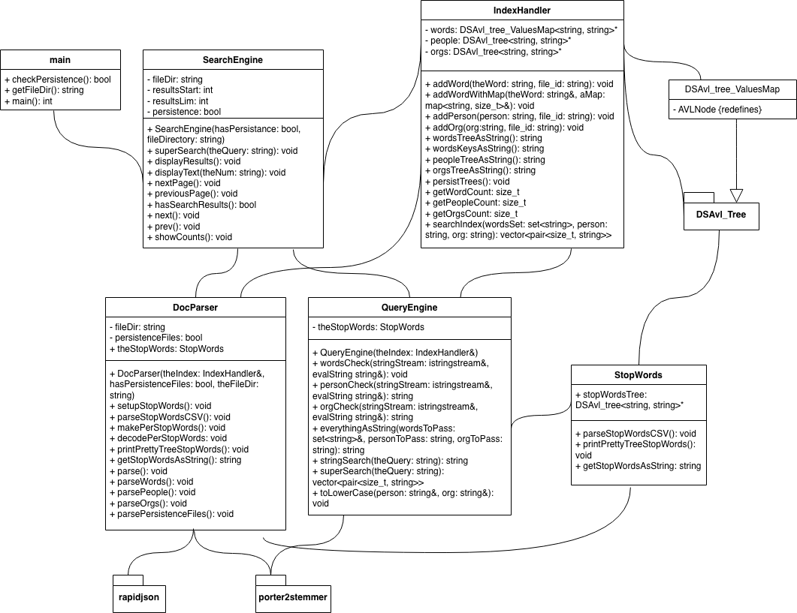

### Data Structures Final Project: "Did it make the News?" Search Engine

Matias Barcelo
Southern Methodist University
CS 2341 (Spring 2024)
Professor Michael Hahsler

This was my final project for [Data Structures.](https://github.com/mhahsler/CS2341) We were required to implement a search engine in C++.

We were given a [Kaggle dataset of Finance Articles from Jan - May 2018 as JSON files,](https://www.kaggle.com/datasets/jeet2016/us-financial-news-articles) an implementation of an [AVL tree data structure (DSAvl_tree),](https://github.com/mhahsler/CS2341/blob/main/Chapter4_Trees/AVLTree/AvlTree.h) a JSON parsing tool called [RapidJSON](https://rapidjson.org/) along with an implementation of the Porter Stemming Algorithm for C++ called [porter2stemmer,](https://bitbucket.org/smassung/porter2_stemmer/src) and asked to create a search engine for the articles by implementing an inverted file index data structure.

Additional details and instructions about the project can be found in the "School_Work" directory.

#### How to use the Search Engine

By default, there should be persistence files for one of the Kaggle Data Sets to try out the program. If there are not any persistence files or the user wants to use another JSON data set (which has the same relevant fields) the user must give the program the path to the directory containing the JSON files relative to where the program or executable lies when prompted. (sample_data  dir can be used for the curious)

Once the program loads and asks for a Query, the user can begin typing out words to search for. After a query is sent, the program will return 15 articles, indexed 0-14, with priority given to articles based off a **"SuperSearch Score"** of times the word appears in the article. The user can then read the article by typing the index number of the result.

e.g. If a user is trying to find articles related to privacy, the user can type

> Please type in search: privacy

and the program will return

> Search took 0.152 seconds
Number of results: 380

>Result #0: 
SuperSearch Score: 637
Title: Bull market still has 'years left,' Raymond James Jeffrey Saut
Publication: www.cnbc.com
Date published: 2018-01-31T15:30:00.000+02:00
...
Result #14: 
SuperSearch Score: 620
Title: Ex-Microsoft CEO Steve Ballmer: The stock market feels a little bubbly
Publication: www.cnbc.com
Date published: 2018-01-31T19:00:00.000+02:00

with the option of displaying the article and going to the next/previous page as described in the bottom of the search result.

> Type number of result to display article text (i.e. for the first article text type '0'). Press enter for new query. Type 'q' to quit.  To go to next or prev page type 'next' or 'prev'). Press enter for new query. Type 'q' to quit.

The user can also search for the name of a person or organization by typing **"PERSON:"** and/or **"ORG:"** in their query, which will cause the results to only include results including the given person and/or org, with the **"SuperSearch Score"** still soley being based off how many times the given **"words"** appear in the article.

e.g. if one wanted to search an article having to do with Mark Zuckerberg, they would type:

> Please type in search: PERSON: Mark Zuckerberg

All articles labeled having to do with Mark Zuckerberg would appear, with 0 SuperSearch scores since no words were typed out.

If one wanted to search for articles having to do with privacy involving Mark Zuckerberg, they could type out

> Please type in search: privacy PERSON: Mark Zuckerberg

For a search about privacy concerning Mark Zuckerberg and the Facebook organization, they would type

> Please type in search: privacy PERSON: Mark Zuckerberg ORG: Facebook

Which also works vice-versa as

> Please type in search: privacy ORG: Facebook PERSON: Mark Zuckerberg

#### How to Build/Run the Project Locally

##### For Linux and Mac Users

Using a terminal, in the **"Code/"** directory, make sure you git clone porter2stemmer using

> git clone https://bitbucket.org/smassung/porter2_stemmer.git

To build the project, you must be familiar with CMake and CMake tools (or at least know how to install their extensions in your IDE) to build out the project. Once the project is built, **"./supersearch"** can be ran in the build folder.

Please make sure your **"build/"** folder containing **"./supersearch"** is in **"Code/"** instead of in the **"CS2341_Final_Proj/"** directory or it will not work.

##### For Windows Users
Downloading/cloning the repo and running SuperSearch.exe in the terminal should work for 64 bit systems. If that is giving you difficulties/ if you want to build the project using CMake, you can follow the instructions for Linux and Mac with the additional option of running package.ps1 in PowerShell to install porter2stemmer instead of cloning the directory.

#### How it works

**main:** What the build uses for the text-based user interface inside the terminal. Also figures out whether or not persistence files are available and to be made.

**SearchEngine:** Driver class for backend. Object used to collect and display results.

**QueryEngine:** Used to stip queries to their stems and remove "stop words" from queries.

**DocumentParser:** Parses JSON files in a given directory for index or loads index with trees from persistence files.

**IndexHandler:** Holds the AVL Trees/inverted file indexes for words, people, and orgs used to generate search results. Returns search results to SearchEngine driver. Creates persistence files when needed.

**DSAvl_tree_ValuesMap:** Inverted file index implementation for super search. 

## Class interaction

* **main** gives **DocumentParser** dir of files to parse or persistent index file to use
* **DocumentParser** works with **IndexHandler** to make inverted file indexes for words, people, and orgs which are really inverted file indexes or AVL Tree data structures with nodes that are maps with values consisting of vectors of RapidJSON **Document**s. During this process stemming and stop word removal is done to words using **StopWords**.
* **main** sends query to **QueryEngine**, which does a similar process to **DocumentParser** in stripping the query search of stop words and stemming those words.
* **QueryEngine** sends stipped query to **IndexHandler**, which uses the inverted file indexs to generate a search result based on how many times the search query words appear in the articles.
* **IndexHandler** returns search result to **QueryEngine** which in turn returns the result to **main** for display to the user.